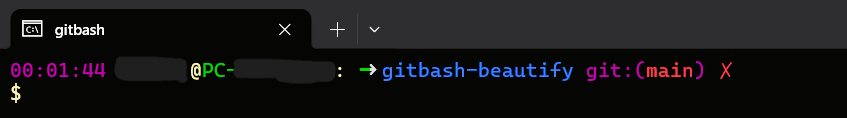
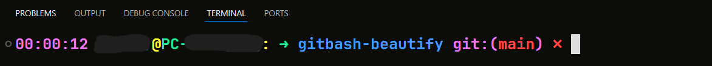
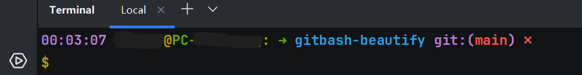
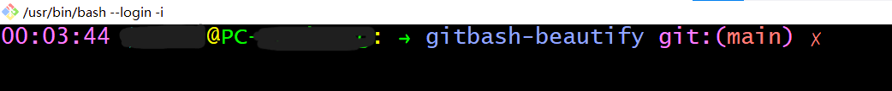

# 让你的 Windows Git Bash 像 robbyrussell 主题 | Make Your Windows Git Bash Look Like robbyrussell Theme

中文版本 | Chinese Version

# gitbash-beautify

## 中文介绍 📚
美化 Windows 上默认的 Git Bash

## 中文功能说明 ⚙️
- 优化 Git Bash 的外观
- 提供更好的用户体验
- 改善命令行界面的显示效果

---

## 安装方法 🛠️
1. 备份现有的 `.bashrc` 文件（如果存在）
2. 将项目中的 `.bashrc` 文件复制到用户主目录 (`~`)
3. 重启 Git Bash 或运行 `source ~/.bashrc` 使更改生效

---

## 使用方法 🚀
- **时间戳和用户信息**: 终端会显示当前时间、用户名和主机名
- **彩色 Git 状态**: 在 Git 仓库中会显示当前分支名，无更改时显示绿色勾号(✓)，有更改时显示红色叉号(✗)
- **增强的 Git 日志**: 使用 `git-lg` 命令显示带图形的提交历史
- **便捷的文件列表**: 使用 `ll` 命令显示详细文件列表
- **优化的 Git 日志**: 使用 `glog` 命令显示格式化的彩色 Git 提交历史

---

## 特色功能 ✨
### 中文说明
- 自动检测终端类型（VSCode、Git Bash、JetBrains IDEs）
- 根据终端类型调整提示符格式（VSCode 和 Git Bash 使用单行提示符，JetBrains 使用双行提示符）
- Git 状态可视化（显示当前分支和修改状态）
- 美化的时间、用户、主机、路径和 Git 信息显示

---

## 截图展示 🖼️
以下是不同终端环境下的实际效果：

  
  
  

---

## 自定义与扩展 💡
本项目旨在提供一个美观且实用的 Git Bash 美化方案，但并不限制用户的个性化需求。你可以：
- 修改 `.bashrc` 文件中的颜色、字体、符号等样式
- 添加新的别名或函数（如 `alias mycmd='echo Hello'`）
- 扩展 `detect_terminal()` 函数以支持更多终端类型
- 添加额外的状态检查逻辑（如未提交文件、远程更新等）

请大胆尝试，打造属于你的专属终端体验！我们鼓励你根据自己的使用习惯进行定制化调整，无需受限于当前实现。

你们可能会问为什么 JetBrains 另起一行？因为 JetBrains 的终端相较于 VSCode 以及 Git Bash 的 mintty 偏小，所以在遇到长命令换行时会出现回显到本行开始的 bug。另起一行可以解决这个问题。这是在我电脑上测试的结果，如果你的终端没有这个问题，也可以改成一行。

English Version | 英文版本

# gitbash-beautify

## English Introduction 📚
Beautify the default Git Bash on Windows

## English Features ⚙️
- Enhance the appearance of Git Bash
- Provide better user experience
- Improve the display effect of command line interface

---

## Installation 🛠️
1. Backup existing `.bashrc` file (if exists)
2. Copy the `.bashrc` file from the project to user home directory (`~`)
3. Restart Git Bash or run `source ~/.bashrc` to apply changes

---

## Usage 🚀
- **Timestamp and User Info**: Terminal displays current time, username and hostname
- **Colored Git Status**: Shows current branch name in Git repository, green checkmark (✓) when no changes, red cross (✗) when there are changes
- **Enhanced Git Log**: Use `git-lg` command to show commit history with graph
- **Convenient File List**: Use `ll` command to show detailed file list
- **Optimized Git Log**: Use `glog` command to show formatted colored Git commit history

---

## Features ✨
### English Features
- Automatically detect terminal type (VSCode, Git Bash, JetBrains IDEs)
- Adjust prompt format based on terminal type (single line for VSCode/Git Bash, double line for JetBrains)
- Visual Git status (show current branch and modification status)
- Beautiful time, user, host, path and Git information display

---

## Screenshot Showcase 🖼️
Here are the actual effects in different terminal environments:

  
  
  

---

## Customization and Extension 💡
This project aims to provide a beautiful and practical Git Bash customization, but it does not limit your personal preferences. You can:
- Modify colors, fonts, symbols, etc., in the `.bashrc` file
- Add new aliases or functions (e.g., `alias mycmd='echo Hello'`)
- Extend the `detect_terminal()` function to support more terminal types
- Add additional status checks (e.g., uncommitted files, remote updates)

Feel free to experiment and create your own personalized terminal experience! We encourage you to customize according to your habits without being restricted by the current implementation.

You might wonder why JetBrains uses a separate line. This is because JetBrains' terminal is smaller compared to VSCode and Git Bash's mintty, so when long commands wrap, they may echo back to the beginning of the current line, causing a bug. Using a separate line solves this issue. This was tested on my machine; if your terminal doesn't have this problem, you can also change it to a single line.

